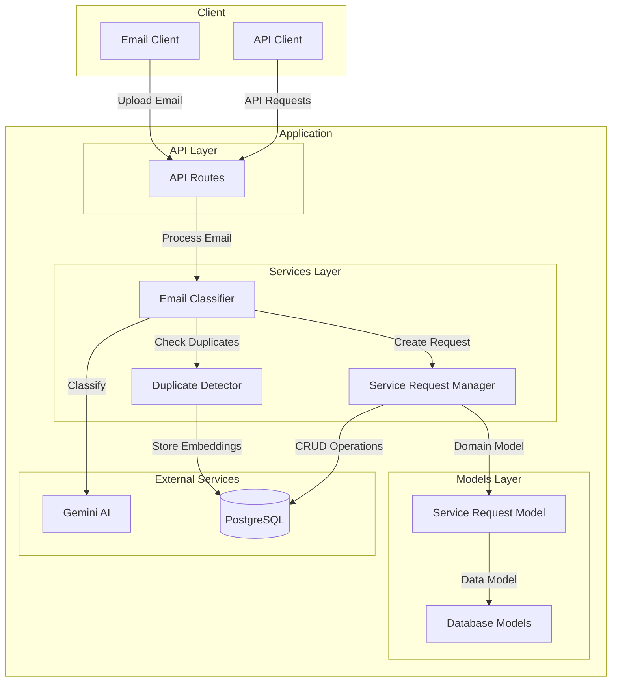

# System Architecture

## High-Level Architecture Diagram



## Component Description

### 1. Client Layer
- **Email Client**: Uploads email files for processing
- **API Client**: Interacts with the system's REST API endpoints

### 2. API Layer
- **API Routes**: Handles HTTP requests and responses
- Endpoints:
  - `/process-email` (POST)
  - `/service-requests/<request_id>` (GET)
  - `/service-requests/team/<team>` (GET)
  - `/service-requests/<request_id>/status` (PUT)

### 3. Services Layer
- **Email Classifier Service**
  - Processes email content
  - Integrates with Gemini AI for classification
  - Coordinates with Duplicate Detector
  - Creates service requests

- **Duplicate Detector Service**
  - Uses sentence transformers for similarity detection
  - Maintains embeddings in database
  - Prevents duplicate processing

- **Service Request Manager**
  - Manages service request lifecycle
  - Handles team assignment
  - Performs CRUD operations

### 4. Models Layer
- **Service Request Model**
  - Domain model for service requests
  - Business logic and validation
  - Data transformation

- **Database Models**
  - SQLAlchemy models
  - Database schema definition
  - Data persistence layer

### 5. External Services
- **Gemini AI**
  - Email classification
  - Information extraction
  - Natural language processing

- **PostgreSQL Database**
  - Stores service requests
  - Stores duplicate detection embeddings
  - Maintains data persistence

## Data Flow

1. **Email Processing Flow**
   ```
   Email Upload → API Route → Email Classifier → Duplicate Check → Classification → Service Request Creation
   ```

2. **Service Request Management Flow**
   ```
   API Request → Service Request Manager → Database Operations → Response
   ```

3. **Duplicate Detection Flow**
   ```
   Email Content → Duplicate Detector → Embedding Generation → Similarity Check → Result
   ```

## Key Features

1. **Modular Design**
   - Clear separation of concerns
   - Independent service components
   - Easy to extend and maintain

2. **Scalability**
   - Database-driven architecture
   - Stateless API design
   - Efficient duplicate detection

3. **Reliability**
   - Error handling at each layer
   - Data validation
   - Transaction management

4. **Security**
   - Environment-based configuration
   - API validation
   - Secure database access

## Technology Stack

- **Backend Framework**: Flask
- **Database**: PostgreSQL
- **ORM**: SQLAlchemy
- **AI Services**: Google Gemini AI
- **ML Libraries**: Sentence Transformers
- **API Documentation**: OpenAPI/Swagger

## Deployment Considerations

1. **Database**
   - Separate database server
   - Connection pooling
   - Backup strategy

2. **AI Services**
   - API rate limiting
   - Error handling
   - Fallback mechanisms

3. **Application Server**
   - Load balancing
   - Caching
   - Monitoring 